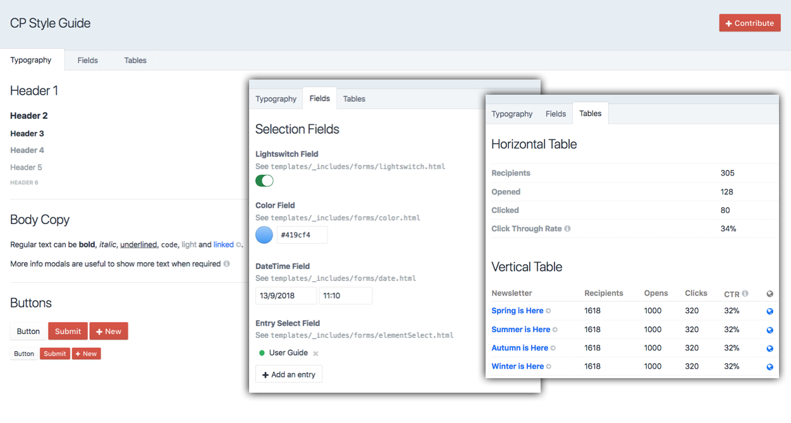

# CP Style Guide Plugin for Craft CMS 3

The CP Style Guide plugin provides a style guide for control panel pages in [Craft CMS](https://craftcms.com/). It helps you when designing and building your plugin's control panel pages by providing markup and twig template tags for generating native elements and form fields in Craft.

## Requirements

Craft CMS 3.0.0 or later.

## Installation

To install the plugin, search for "CP Style Guide" in the Craft Plugin Store, or install manually using composer.

        composer require putyourlightson/craft-cp-style-guide

## Usage

To view the style guide, install the plugin and click on the CP Style Guide in the main control panel navigation. View the source code in the plugin's template directory to see how to generate the form fields using twig template tags. 

Works well in combination with the [Plugin UXD](https://github.com/putyourlightson/craft-plugin-uxd) plugin.

## Contributing

The style guide is a work in progress. To contribute and help make it more complete, please create a github issue or a pull request.

<small>Created by [PutYourLightsOn](https://putyourlightson.com/).</small>
